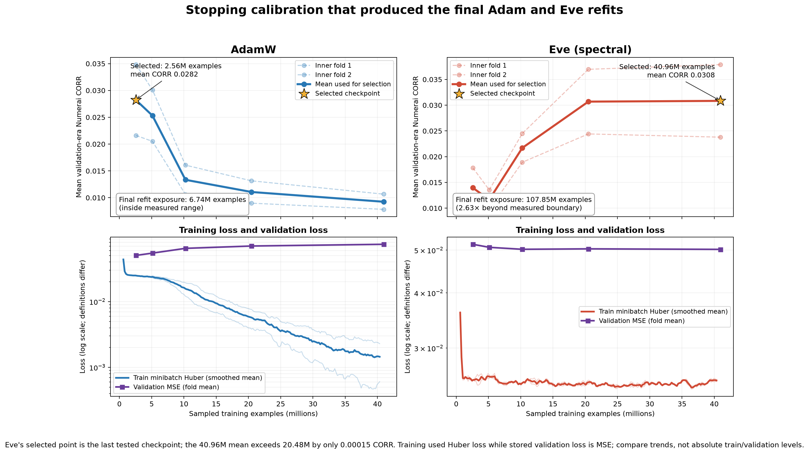

# Corrected live refit and Numerai outcome

Status as of 2026-08-21. This is the authoritative post-upload record for the corrected
`eden_adam` and `eden_eve` refits.

## What was uploaded

Both callables use all 574 resolved v5.3 training eras, the full feature set, three seeds,
standalone model weight 1.0, and no stake. Numerai accepted both replacements in the Python 3.12,
v5.3 Model Upload environment and generated successful live submissions.

| Slot | Arm | Config | Parameters | Sampled examples | Upload ID | Bundle SHA-256 |
|---|---|---:|---:|---:|---|---|
| `eden_adam` | AdamW | 38 | 6,799,361 | 6,740,992 | `e2e92763-3395-4b13-a4c5-a237492825a0` | `5238b8ea47a5b44bcfe5963073418a4be077aea123f0c07f90ce66c7fb34fccc` |
| `eden_eve` | spectral | 39 | 10,194,433 | 107,849,728 | `83b153f8-63d5-4c4d-8a2c-04ab5021a809` | `3fb39509155497836530920e8f8e2a00dd148016ada819823e49b8b3ff3085c7` |

The export defect encountered after training was schema-only: the corrected candidate plan used
an unrecognised status and omitted `model_weight`. Commit `b30e577` aligned it with the shared
frozen-candidate schema. All model hashes and training outputs remained unchanged; nine relevant
regression tests and callable inference smokes passed before upload.

## Numerai diagnostics

Diagnostics cover 642 eras, 579--1220, using v5.3 `target_ender_60`. The local `target` column is
exactly equal to `target_ender_60`, and local scoring uses the official era-wise Numerai CORR
implementation, so the reversal is not a target or metric mismatch.

| Metric | `eden_adam` | `eden_eve` |
|---|---:|---:|
| Mean CORR | **0.036058** | 0.014690 |
| CORR Sharpe | **1.9028** | 1.0702 |
| Mean BMC | **0.002030** | -0.007616 |
| Maximum feature exposure | **0.191546** | 0.618720 |
| Last-100-era CORR | **0.015954** | 0.002085 |
| Maximum drawdown | **-0.044587** | -0.211681 |

The primary offline outer holdout covered only eras 313--390. Across three seeds it gave AdamW
approximately 0.0199 mean CORR and spectral approximately 0.0229, a modest spectral advantage of
about 0.003 in one 78-era interval. That result did not generalise to Numerai's much larger and
later diagnostic interval. Eve's diagnostic CORR fell from 0.01956 in the first half to 0.00982 in
the second half and 0.00208 over the last 100 eras. Its extreme feature exposure is consistent
with a temporally unstable, concentrated solution.

## Stopping-selection limitation

Only five validation checkpoints were stored: 2.56M, 5.12M, 10.24M, 20.48M, and 40.96M sampled
examples. AdamW selected the first checkpoint. Spectral selected the final boundary, but its mean
CORR at 40.96M exceeded 20.48M by only 0.00015. The protocol then multiplied exposure by
574/218 to preserve sampled examples per training era. This produced 6.74M final examples for
AdamW and 107.85M for spectral, although no spectral validation measurement existed beyond
40.96M. Both arms saw the same unique eras and rows; spectral repeatedly sampled them far more
often.

This is a serious confound. The uploaded comparison also changes architecture, batch size,
schedule, dropout, weight decay, and training duration alongside the optimizer. It compares the
best arm-specific candidates found, not an optimizer-only intervention. A future causal test must
hold architecture, batch size, sampled-example budget, schedule, and regularisation fixed while
changing only the optimizer/filter. No further experiment was launched as part of this audit.

## Monitoring

Numerai Model Upload runs both fixed callables automatically on new live data. Track them on the
Numerai Models/Submissions page for daily execution status and on the leaderboard/model pages for
pending and resolved live CORR/BMC. Diagnostics are historical validation measurements and do not
change each round. Live target-dependent scores arrive only after the relevant return horizon has
partially matured and remain provisional until the round resolves; compare Adam and Eve only on
matched rounds.
